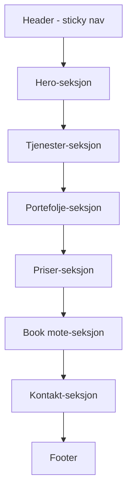
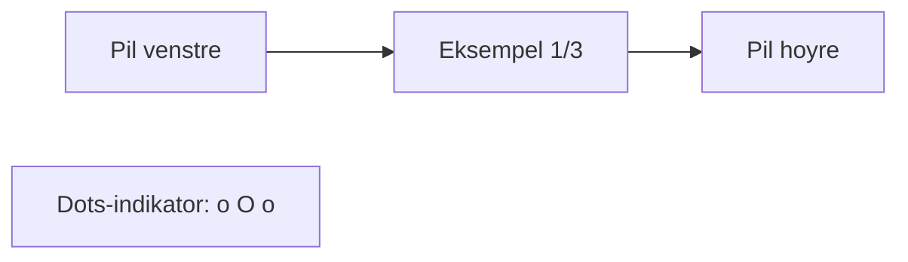
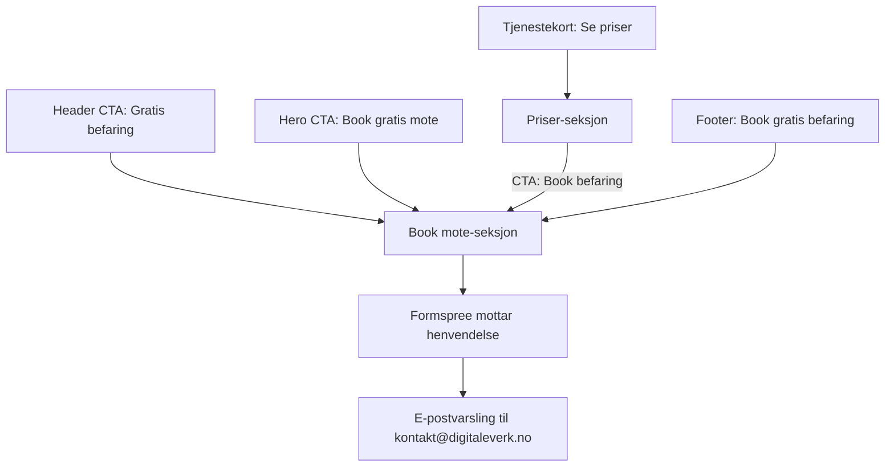

# Digitale Verk - Full nettside

## Oversikt

Bygge ut `digitaleverk.no` fra en "kommer snart"-landingsside til en fullverdig markedsforingsside med seks hovedseksjoner: **Hero**, **Tjenester**, **Portefolje**, **Priser**, **Book mote** og **Kontakt**. Statisk HTML/CSS/JS pa GitHub Pages. Norsk sprak.

## Eksisterende designsystem

| Element | Verdi |
|---------|-------|
| Primaerfarge gull | `#c9b07a` |
| Bakgrunn | `#0f0f10` |
| Tekst | `#f5f5f5` |
| Sekundaertekst | `#c8c8c8` |
| Font | Inter, Arial, sans-serif |
| Border-radius knapper | 14px |
| Border-radius kort | 28px |
| Border-radius pills | 999px |
| Stil | Mork, minimalistisk, glassmorfisme |

## Sidestruktur



## Filstruktur etter implementering

```
DVsiteEX/
  index.html            -- Hovedside med alle seksjoner
  styles/
    main.css            -- All CSS separert fra HTML
  scripts/
    main.js             -- Navigasjon, scroll-animasjoner, karusell, skjemaer
  assets/
    images/
      ikon.png          -- Eksisterende favicon
      logo.png          -- Eksisterende logo
      portfolio/        -- Screenshots av prosjekter
        dashboard-1.webp
        booking-1.webp
        kurs-1.webp
      pricing/          -- Eksempelbilder for prispakker
        enkel-1.webp
        enkel-2.webp
        enkel-3.webp
        standard-1.webp
        standard-2.webp
        standard-3.webp
        premium-1.webp
        premium-2.webp
        premium-3.webp
  CNAME                 -- Beholdes som er
```

## Detaljert plan per seksjon

### 1. Strukturelle forbedringer

- **Separer CSS** fra `index.html` til `styles/main.css`
- **Separer JS** til `scripts/main.js`
- **Legg til SEO-meta**: Open Graph, Twitter Card, canonical URL, JSON-LD
- **Legg til Google Fonts-import** for Inter med riktige vekter: 400, 500, 600, 700

### 2. Header / Navigasjon

- Sticky header med bakgrunnsblur ved scroll
- Logo + "Digitale Verk" til venstre
- Navigasjonslenker: Tjenester, Portefolje, Priser, Book mote, Kontakt
- CTA-knapp: "Gratis befaring" - lenker direkte til book mote-seksjonen
- Hamburgermeny pa mobil med slide-in meny
- Aktiv seksjon-indikator basert pa scroll-posisjon via IntersectionObserver

### 3. Hero-seksjon

Beholder mye av eksisterende design men oppgradert:

- **Eyebrow-badge**: "Digitale losninger for moderne bedrifter"
- **Overskrift**: Stor, kraftig headline om hva Digitale Verk gjor
- **Undertekst**: Kort beskrivelse av verdiforslaget
- **To CTA-knapper**: "Se tjenester" og "Book gratis mote"
- **Hoyresiden**: Stilisert mockup/illustrasjon eller logo-kort som i dag
- **Info-pills**: Stikkord som "Dashboards", "Bookingsider", "Kursplattformer", "Nettsider"
- **Gratis-badge**: Fremhev "Forste mote er gratis" som et distinkt visuelt element

### 4. Tjenester-seksjon

Fire tjenestekort i et 2x2 grid pa desktop, 1-kolonne pa mobil:

| Tjeneste | Beskrivelse |
|----------|-------------|
| Analyse-dashboards | Oversiktlige dashboards for data og KPIer |
| Bookinglosninger | Bookingsystemer tilpasset din bedrift |
| Kursplattformer | Digitale plattformer for kurs og opplaering |
| Nettsider og webapper | Moderne, raske nettsider og webapplikasjoner |

Hvert kort har:
- Ikon via SVG inline
- Tittel
- Kort beskrivelse med 2-3 setninger
- Subtil hover-effekt med gull-border
- Liten CTA-lenke: "Se priser" som lenker ned til prisseksjonen

### 5. Portefolje-seksjon

- Seksjonstittel: "Hva vi har laget"
- Grid med prosjektkort, hvert kort viser:
  - Screenshot/mockup av prosjektet
  - Prosjektnavn
  - Kort beskrivelse
  - Tags for type losning
- Placeholder-kort med stiliserte mockups inntil ekte screenshots er tilgjengelige
- Bildene bruker lazy loading og `object-fit: cover`
- Lightbox-effekt ved klikk pa bilde via ren JS

### 6. Priser-seksjon - NY

Seksjonstittel: "Hva koster det?"
Undertekst: "Velg en pakke som passer din bedrift. Alle priser er veiledende - vi tilpasser losningen etter dine behov."

**Tre priskort side om side** pa desktop, stablet pa mobil:

#### Pakke 1: Enkel
- Pris: `fra 14 990 kr` (placeholder)
- Beskrivelse: "Perfekt for deg som trenger en enkel, profesjonell digital losning"
- Inkluderer-liste:
  - Responsivt design
  - Inntil 5 sider/visninger
  - Kontaktskjema
  - SEO-grunnpakke
  - 1 runde med tilbakemeldinger
- **Eksempel-karusell**: 3 mockups/screenshots man kan bla gjennom som viser hva man kan fa for denne prisen. F.eks. enkel landingsside, bedriftsside, visittkort-nettside.
- CTA: "Book befaring"

#### Pakke 2: Standard - fremhevet som "Mest populaer"
- Pris: `fra 39 990 kr` (placeholder)
- Beskrivelse: "For bedrifter som trenger mer funksjonalitet og skreddersying"
- Inkluderer alt i Enkel, pluss:
  - Avansert funksjonalitet: booking, dashboards, etc.
  - Inntil 15 sider/visninger
  - Integrasjoner med tredjepart
  - 3 runder med tilbakemeldinger
  - 3 maaneder support
- **Eksempel-karusell**: 3 mockups av mer avanserte losninger. F.eks. bookingside, analysedashboard, kursplattform.
- CTA: "Book befaring"

#### Pakke 3: Premium
- Pris: `fra 79 990 kr` (placeholder)
- Beskrivelse: "Komplett skreddersydd digital plattform for din bedrift"
- Inkluderer alt i Standard, pluss:
  - Ubegrenset sider/visninger
  - Avanserte integrasjoner og API
  - Brukertesting og optimalisering
  - Ubegrenset tilbakemeldinger i prosjektperioden
  - 12 maaneder support og vedlikehold
- **Eksempel-karusell**: 3 mockups av komplette plattformer. F.eks. fullstendig bookingplattform, admin-panel med dashboard, skreddersydd webapp.
- CTA: "Book befaring"

#### Eksempel-karusell teknisk design

Hver prispakke har en innebygd bildekarusell:



- Horisontal scroll med CSS `scroll-snap-type: x mandatory`
- Navigasjonspiler pa hver side
- Dots-indikator under som viser aktivt bilde
- Swipe-stotte pa mobil via touch events i JS
- Bilder er stiliserte mockups i glassmorfisme-rammer
- Hover viser kort beskrivelse av eksempelet som overlay

### 7. Book mote-seksjon

Dedikert seksjon for a booke gratis forste mote/befaring/brainstorming:

**Layout**: To-kolonne design
- **Venstre kolonne - Salgsbudskap**:
  - Overskrift: "Book et gratis mote"
  - Undertekst: Forklar hva motet inneholder
  - Fire USPer med ikoner:
    - "Helt gratis og uforpliktende"
    - "30-60 min brainstorming"
    - "Konkret forslag til losning"
    - "Ingen bindingstid"

- **Hoyre kolonne - Bookingskjema**:
  - Glassmorfisme-kort med skjema:
    - Navn - tekstfelt
    - Bedrift - tekstfelt
    - E-post - tekstfelt
    - Telefon - tekstfelt, valgfritt
    - Hvilken pakke interesserer deg? - dropdown: Enkel, Standard, Premium, Vet ikke enda
    - Foretrukket tidspunkt - fritekst
    - Kort beskrivelse - textarea, valgfritt
    - "Book gratis mote"-knapp i gull

**Teknisk**: Formspree for skjemahaandtering. Bekreftelsesmelding inline etter innsending. Klientside-validering i JS.

**Visuelt**: Subtil gull-gradient bakgrunn for a skille seg ut som hovedkonverteringspunkt.

### 8. Kontakt-seksjon

Enklere seksjon for generelle henvendelser:

- Overskrift: "Har du sporsmaal?"
- Kontaktinformasjon: E-post, eventuelt telefon
- Enkel melding: "Foretrekker du a booke et mote direkte? Bruk booking-seksjonen over."
- Lenke til e-post: `kontakt@digitaleverk.no`

### 9. Footer

- Logo og firmanavn
- Navigasjonslenker
- E-postadresse
- CTA: "Book gratis befaring"
- Copyright 2026

### 10. Animasjoner og interaktivitet

- **Scroll-animasjoner**: Elementer fader inn med IntersectionObserver
- **Smooth scroll**: Via CSS `scroll-behavior: smooth`
- **Header**: Bakgrunn endrer seg ved scroll med `backdrop-filter: blur`
- **Kort hover**: Subtil skaleering og gull-border pa tjeneste-, portefolje- og priskort
- **Karusell**: Swipe og klikk-navigasjon for priseksempler
- **Mobil meny**: Animert slide-in
- **Skjema-feedback**: Inline bekreftelse/feilmelding med animasjon

### 11. Responsivt design

Tre breakpoints:

| Breakpoint | Beskrivelse |
|------------|-------------|
| > 920px | Full desktop: 2-kolonne hero/booking, 2x2 tjenester, 3 priskort side om side |
| 641-920px | Tablet: 1-kolonne hero, 2-kolonne tjenester, priskort scrollbar horisontalt |
| <= 640px | Mobil: alt 1 kolonne, hamburgermeny, priskort stablet, karusell med swipe |

### 12. Ytelse og tilgjengelighet

- Bilder i WebP-format med fallback
- Lazy loading pa portefolje- og priseksempelbilder
- Preconnect til Google Fonts
- ARIA-attributter pa navigasjon, karuseller og skjemaer
- Tastaturnavigasjon for alle interaktive elementer inkl. karusell
- Skip-to-content-lenke
- Fargekontrast i WCAG AA-standard

## Implementeringsrekkefolge

1. Opprett mappestruktur og separer CSS/JS fra HTML
2. Bygg header med navigasjon og mobil hamburgermeny
3. Oppgrader hero-seksjonen med "Book gratis mote" CTA
4. Bygg tjenester-seksjonen med kort
5. Bygg portefolje-seksjonen med placeholder-mockups
6. Bygg priser-seksjonen med tre pakker og eksempel-karuseller
7. Bygg book mote-seksjonen med skjema og USPer
8. Bygg kontakt-seksjonen
9. Bygg footer
10. Legg til scroll-animasjoner og interaktivitet
11. Responsivt design - test og juster alle breakpoints
12. SEO-meta, tilgjengelighet og ytelsesoptimalisering

## Konverteringsflyt



## Avhengigheter og risiko

- **Bilder**: Trenger mockups/screenshots for portefolje og priseksempler. Starter med stiliserte placeholders i CSS som kan byttes ut med ekte bilder senere.
- **Bookingskjema backend**: Formspree gratis for opptil 50 innsendinger/maned.
- **Google Fonts**: Ekstern avhengighet. Kan selvhostes senere.
- **Ingen byggsystem**: Vanilla HTML/CSS/JS. Enkelt a vedlikeholde og deploye.
- **Priser**: Alle priser er placeholders som ma oppdateres med ekte priser for. Enkelt a endre i HTML.
- **Karusell**: Bygges med CSS scroll-snap + minimal JS. Ingen eksterne biblioteker.
